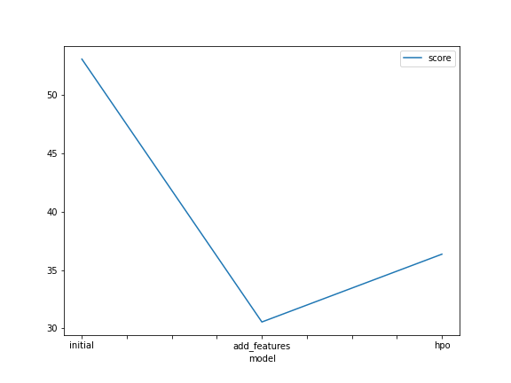
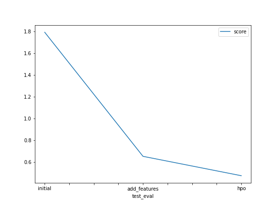

# Report: Predict Bike Sharing Demand with AutoGluon Solution
#### Javier Castillo P.

## Initial Training
### What did you realize when you tried to submit your predictions? What changes were needed to the output of the predictor to submit your results?
The output of the predictor were floating values, so they were rounded to integer values in order to submit them to Kaggle. There were no negative values in the outputs, so it was not necessary to convert them to zero.

### What was the top ranked model that performed?
The top ranked model (WeightedEnsemble_L3) was obtained after running hyperparameter optimization which surpassed the test score of the model (WeightedEnsemble_L3 model) with default hyperparameters and “best quality” presets. However, it is worth mentioning that the latter had better validation score than the former.

## Exploratory data analysis and feature creation
### What did the exploratory analysis find and how did you add additional features?
  
The exploratory data analysis helped to detect the following findings:
-	No missing values were detected in train and test datasets.
-	The columns “casual” and “registered” were present only in the train dataset, so they were ignored in the training process.
-	The columns "season", "weather", "holiday", and "workingday" were initially found as integer values, so they were set as categories.
-	** I the train dataset, there were only 3 events with weather of type 4 “Heavy Rain”, so they were merged with events of type 3 (“Light rain”).
  
The following features were included:
-	'hour'. The purpose of the model is to predict hourly demand, so it was important to include an hour feature which was extracted from the “datetime” column. In addition AutoGluon detects 4 additional features from the “datetime” column, they are ‘datetime.year', 'datetime.month', 'datetime.day', and 'datetime.dayofweek'. 
-	'daytime'. It was observed different bike demand times during a day which were set as new features. They were classified as “morning”, “lunch”, “rush_hour” (peak demand), “night”, and “other”. 
-	'atempcat'. This category was generated from the “atemp” feature ("feels like" temperature in Celsius) considering the normal distribution showed in the histograms. The “atemp” values were classified as "very hot", "hot", "warm", "cool", and "cold".
-	'windcat'. Wind speed values were classified as “low”, “mild”, and “windy”.
-	'humiditycat'. Humidity values were classified as “low”, “mild”, and “high”.
-	These new features were set as category data types.

### How much better did your model preform after adding additional features and why do you think that is?
Adding new features improved the model performance significantly from 1.8.. to 0.555 in the test score. It may seem that feature engineering helped the model to consider more information that was not explicitly listed in the dataset. For instance, the 'hour' and 'daytime' features help to relate a specific event (row) in the dataset and their respective bike demand. Similarly, weather conditions classified in categories give extra information to the model than continuous values only.

## Hyper parameter tuning
### How much better did your model preform after trying different hyper parameters?
Hyper parameters optimization was key to achieve the best performance. The test score improved from *** to *** . The hyper parameters num_stack_levels, num_bag_folds, and  num_bag_sets were set to the maximum accepted values of 3, 10 and 20, respectively.
In addition, individual model hyperparameters were set. 

### If you were given more time with this dataset, where do you think you would spend more time?
I consider there is more room for improve feature engineering. For instance, we can explore the relationship of features with the past values of the target, which are also known as “lag features”. 
On the other hand, hyperparameter optimization may require more machine learning expertise to increase performance efficiently.

### Create a table with the models you ran, the hyperparameters modified, and the kaggle score.
|model|hpo1|hpo2|hpo3|score|
|--|--|--|--|--|
|initial|?|?|?|?|
|add_features|?|?|?|?|
|hpo|?|?|?|?|

### Create a line plot showing the top model score for the three (or more) training runs during the project.

TODO: Replace the image below with your own.

### Create a line plot showing the top kaggle score for the three (or more) prediction submissions during the project.

TODO: Replace the image below with your own.

## Summary
TODO: Add your explanation
